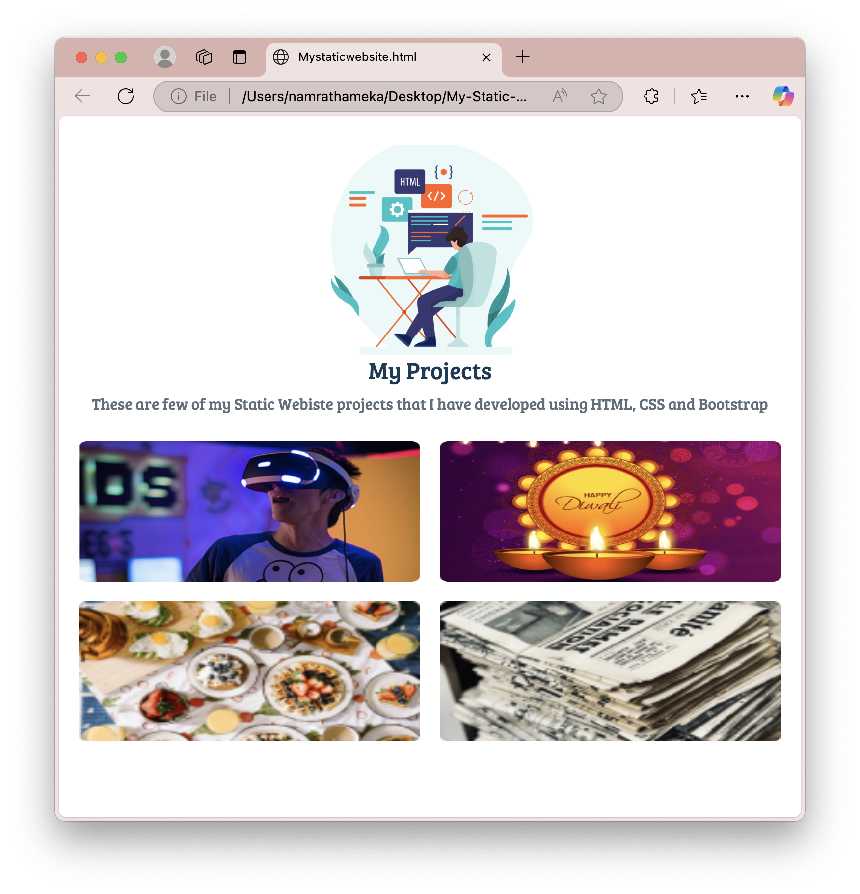
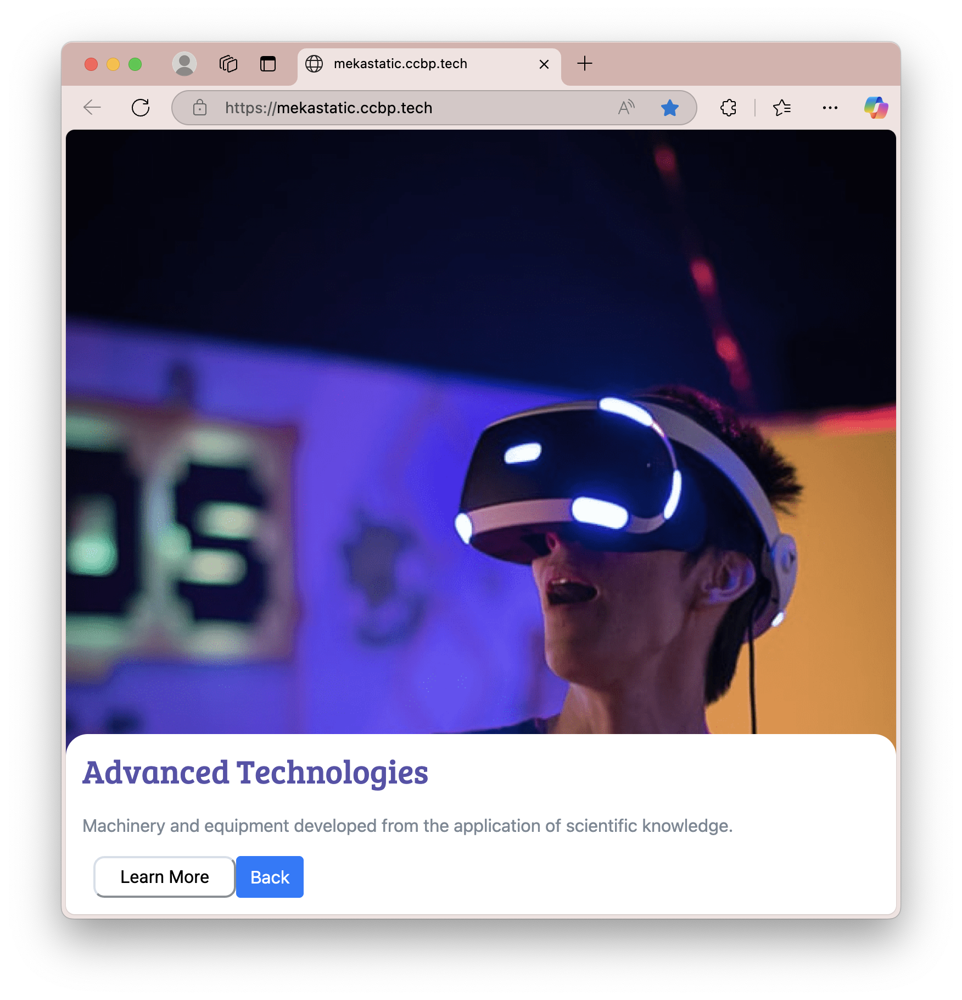
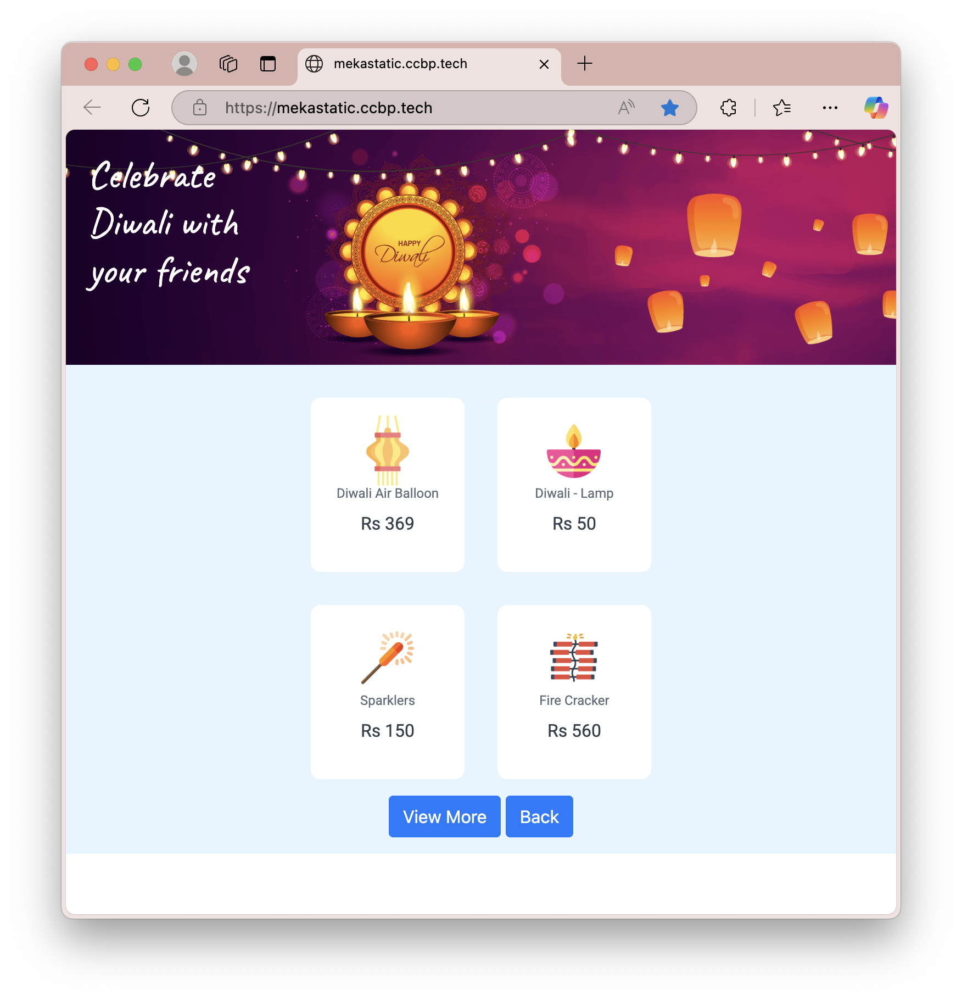
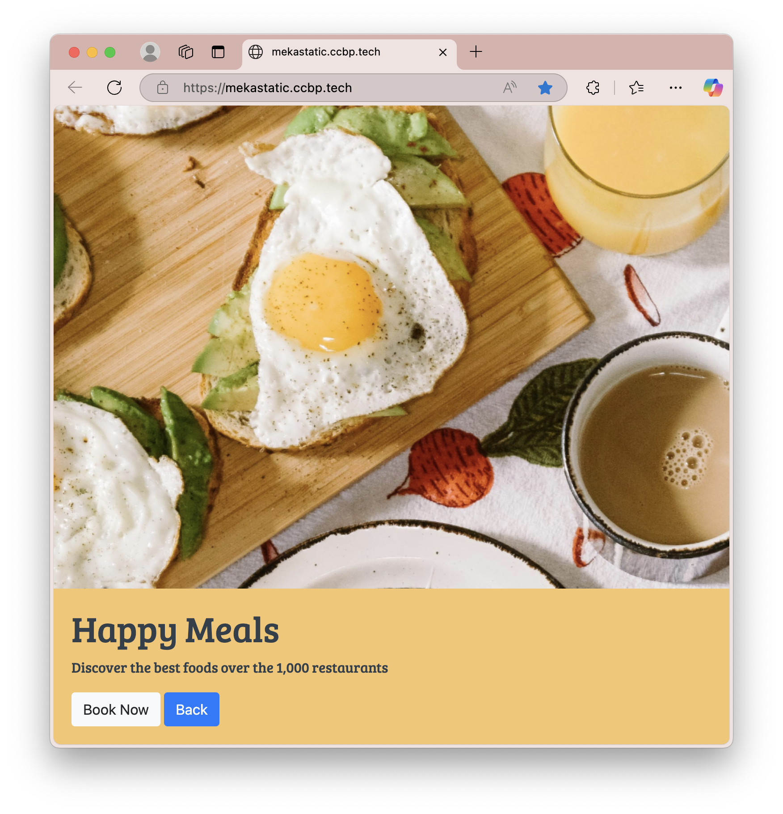
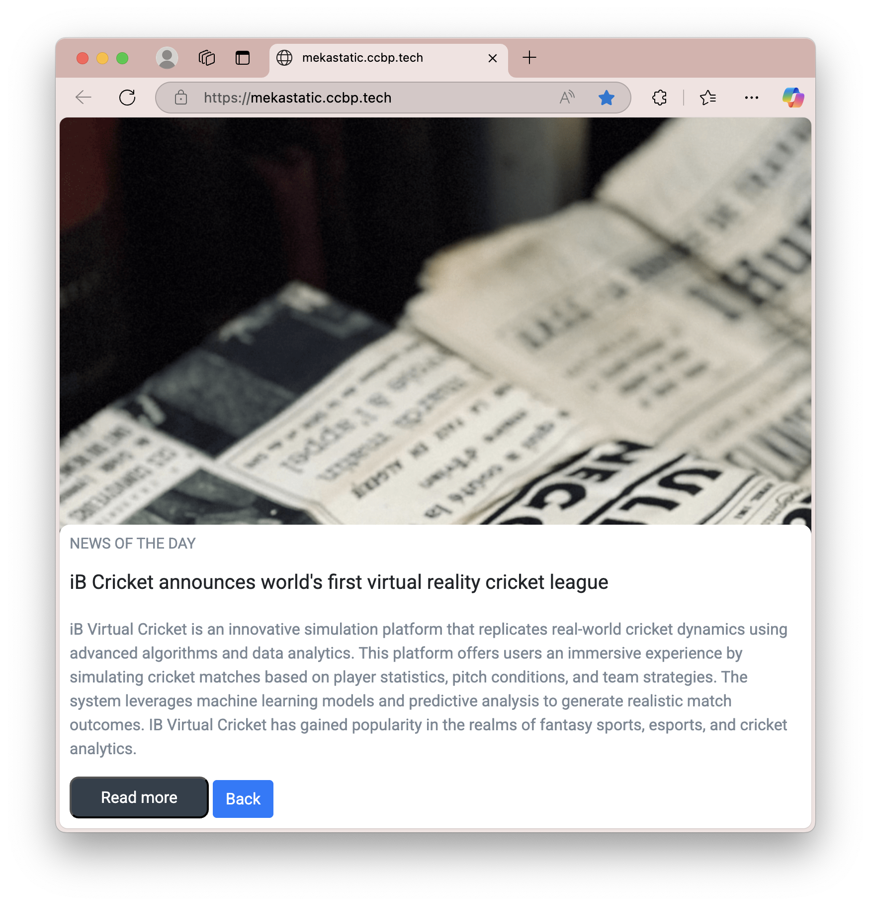

# Meka Static Website Portfolio

---

## Overview

This repository contains a static website portfolio showcasing my front-end development skills using **HTML5**, **CSS3**, and **Bootstrap 4.5.2**. The project features a home page with interactive image icons that link to four distinct sections: **Advanced Technologies**, **Diwali Celebration**, **Happy Meals**, and **News of the Day**. Each section demonstrates unique styling and layouts, highlighting my ability to create responsive and visually appealing web pages.

The live version of this project is deployed at **[mekastatic.ccbp.tech](http://mekastatic.ccbp.tech)**, where you can explore the full functionality.

---

## Features

- **Responsive Design**: Built with Bootstrap to ensure seamless display on desktops, tablets, and mobile devices.
- **Interactive Navigation**: Clickable image icons on the home page lead to individual sections, with "Back" buttons for easy navigation.
- **Section Highlights**:
  - **Advanced Technologies**: Showcases modern machinery with a clean, tech-inspired design.
  - **Diwali Celebration**: Displays festive items (e.g., lamps, fireworks) with prices, styled in a vibrant theme.
  - **Happy Meals**: Features a food-related section with a booking call-to-action.
  - **News of the Day**: Presents a news article about a virtual reality cricket league, with detailed text styling.
- **Custom Styling**: Incorporates Google Fonts (Bree Serif, Caveat, Roboto) and custom CSS for a polished look.
- **External Resources**: Uses CDN-hosted libraries and CloudFront-hosted images for efficiency.

---
## Screenshots

### Home Page
  
*The main landing page with project icons.*

### Advanced Technologies
  
*A tech-themed section with a modern design.*

### Diwali Celebration
  
*A festive section with item cards.*

### Happy Meals
  
*A food-inspired section with a booking option.*

### News of the Day
  
*A news article layout with detailed text.*

---

## Technologies Used

- **HTML5**: Semantic structure for accessibility and SEO.
- **CSS3**: Custom styles for layout, typography, and visual effects.
- **Bootstrap 4.5.2**: Responsive grid system and pre-built components.
- **JavaScript**: Basic interactivity (e.g., section switching via `display()` function).
- **External Libraries**:
  - jQuery 3.5.1 (Slim) - `<script src="https://code.jquery.com/jquery-3.5.1.slim.min.js">`
  - Popper.js 1.16.1 - `<script src="https://cdn.jsdelivr.net/npm/popper.js@1.16.1/dist/umd/popper.min.js">`
  - Bootstrap JS - `<script src="https://stackpath.bootstrapcdn.com/bootstrap/4.5.2/js/bootstrap.min.js">`
  - CCBP UI Kit - `<script src="https://new-assets.ccbp.in/frontend/content/static-ccbp-ui-kit/static-ccbp-ui-kit.js">`
- **Fonts**: Google Fonts (`Bree Serif`, `Caveat`, `Roboto`, etc.) via `@import url('https://fonts.googleapis.com/css2?...')`.

---
